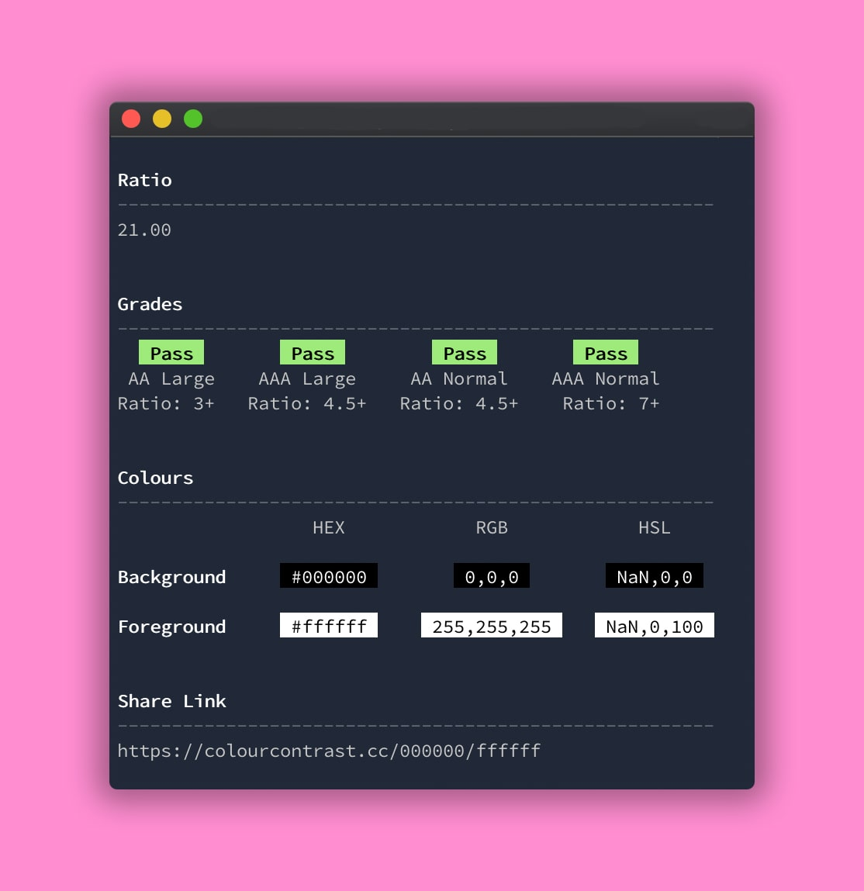

<div align="center">
  <h1>Colour Contrast Checker CLI</h1>
  <p>Command line tool to check the contrast between two colours against WCAG standards</p>
</div>

## Install

```sh
npm install -g colour-contrast-cli
# or
yarn add --global colour-contrast-cli
```

## Usage

```sh
Usage
  $ contrast black white

Options
  --ratio, -r Show only contrast ratio
  --grades, -g Show only WCAG grades

Examples
  $ contrast black white
  $ contrast '#000000' '#ffffff'
  $ contrast  0,0,0 255,255,255
```

## Example Output



## Related projects

- [Colour Contrast Checker Web App](https://colourcontrast.cc) - Use the web app to check colour contrast as well as some other goodies such as saving colours.
- [Colour Contrast Checker Chrome](https://chrome.google.com/webstore/detail/colour-contrast-checker/nmmjeclfkgjdomacpcflgdkgpphpmnfe) - Check the contrast of colours with ease while browsing through the web using my handy chrome extension.
